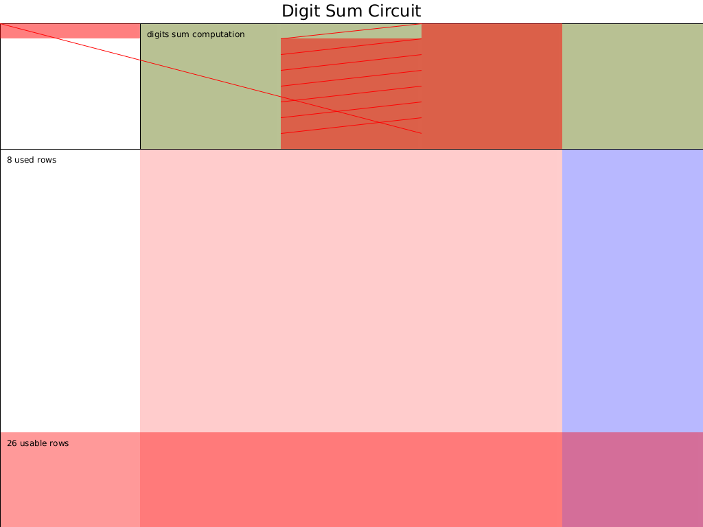

# <p align="center">Halo2 zk-SNARK "Digit sum" circuit example :lock: </p>

<div align="center">
  <a href='https://github.com/jpraynaud/halo2-digitsum/actions'>
    
  </a>
  <a href='https://github.com/jpraynaud/halo2-digitsum/issues'>
    
  </a>
  <a href='https://github.com/jpraynaud/halo2-digitsum/network/members'>
     
  </a>
  <a href='https://github.com/jpraynaud/halo2-digitsum/stargazers'>
    
  </a>
  <a href='https://github.com/jpraynaud/halo2-digitsum/blob/main/LICENSE'>
    
  </a>
</div>

## Introduction

This project is a very simple example implementation of a **zk-SNARK** circuit with [Halo 2](https://github.com/zcash/halo2) proof system.

## Goal

In simple words, **Alice** wants to _convince_ **Bob**:
- that she _knows_ a **number** she _does not want to reveal_ to **Bob** (and which can be represented with `8` digits).
- that the **sum of the digits** of this number is equal to another public **number** that **Bob** knows.


## Pre-requisites

- Have a [correctly configured](https://www.rust-lang.org/learn/get-started) Rust toolchain (latest stable version, at least `1.77`).

## Build the CLI

### Download source

```bash
$ git clone https://github.com/jpraynaud/halo2-digitsum
$ cd halo2-digitsum
```

### Run the tests

```bash
$ make test
```

### Build the documentation

```bash
$ make doc
```

### Build the binary

Compile the binary

```bash
$ make build
```

### Available commands

```bash
$ ./digitsum --help
This program proves and verifies the computation of the sum of the digits of a number.

Usage: digitsum [OPTIONS] <COMMAND>

Commands:
  prove   Run the prover for the digit sum circuit
  verify  Run the verifier for the digit sum circuit
  graph   Run the graph exporter for the digit sum circuit
  help    Print this message or the help of the given subcommand(s)

Options:
  -v, --verbose...  Verbosity level (-v=warning, -vv=info, -vvv=debug)
  -h, --help        Print help
  -V, --version     Print version
```

Here are the available commands:

| Command | Performed action |
|------------|------------------|
| **prove** | Run the prover for the digit sum circuit |
| **verify** | Run the verifier for the digit sum circuit |
| **graph** | Run the graph exporter for the digit sum circuit |

#### `prove` command

```bash
$ ./digitsum prove --help
Run the prover for the digit sum circuit

Usage: digitsum prove [OPTIONS] --witness <WITNESS> --statement <STATEMENT>

Options:
  -w, --witness <WITNESS>
          Secret number that Alice knows (a.k.a. the witness)
  -s, --statement <STATEMENT>
          Public number that Bob knows and which represents the sum of the digits of the witness (a.k.a. the statement)
      --proof-file-name <PROOF_FILE_NAME>
          Proof export filename [default: proof.hex]
      --proof-export-dir <PROOF_EXPORT_DIR>
          Proof export directory [default: ./]
  -h, --help
          Print help
```

#### `verify` command

```bash
$ ./digitsum verify --help
Run the verifier for the digit sum circuit

Usage: digitsum verify [OPTIONS] --statement <STATEMENT>

Options:
  -s, --statement <STATEMENT>
          Public number that Bob knows and which represents the sum of the digits of the witness (a.k.a. the statement)
      --proof-file-name <PROOF_FILE_NAME>
          Proof import filename [default: proof.hex]
      --proof-import-dir <PROOF_IMPORT_DIR>
          Proof import directory [default: ./]
  -h, --help
          Print help
```

#### `graph` command

```bash
$ ./digitsum graph --help
Run the graph exporter for the digit sum circuit

Usage: digitsum graph [OPTIONS]

Options:
      --graph-file-name <GRAPH_FILE_NAME>
          Circuit layout export filename [default: circuit-layout.png]
      --graph-export-dir <GRAPH_EXPORT_DIR>
          Circuit layout export directory [default: ./]
      --graph-with-labels
          Circuit layout with labels
      --graph-width <GRAPH_WIDTH>
          Circuit layout width [default: 1024]
      --graph-height <GRAPH_HEIGHT>
          Circuit layout height [default: 768]
  -h, --help
          Print help
```

### Run the protocol

#### Create a proof

Create a proof with the `prove` sub-command:

```bash
$ ./digitsum prove --witness 123 --statement 6 --proof-file-name proof.hex
>> Proof generated to "./proof.hex"
```

#### Verify a proof

Verify a proof with the `verify` sub-command:

```bash
$ ./digitsum verify --statement 6 --proof-file-name proof.hex
>> Proof verified!
```

#### Generate the circuit layout

Generate the layout of the circuit with the `graph` sub-command:

```bash
$ ./digitsum graph --graph-file-name circuit-layout.png
>> Circuit layout generated to "./circuit-layout.png"
```

And visualize the rendered circuit layout:
[](circuit-layout.png)


